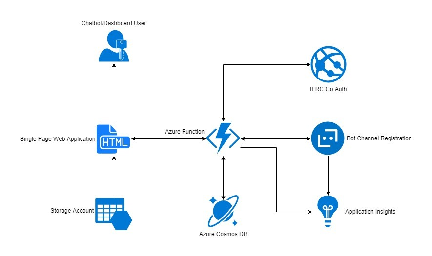

# Red Cross Disaster Assessment Application

Red Cross’ International Services Department (ISD) requires an intuitive and reliable tool to capture damage assessment data following disasters. Current business processes include paper forms, telephone communications and text messages which collectively represent the damage assessment data. That data is unstructured and disparate. Unstructured and disparate data make reporting in a meaningful way difficult. Without accurate reporting, the Red Cross cannot provide detailed activity summaries for in-country and NHQ leadership.

To overcome that challenge, ISD needs a simple to use, secure, multi-channel chat bot data collection system. That system must be easily managed to support a variety of evolving needs. The system must use modern User Experience (UX) design principles to facilitate ease of use. The system must be built using free/open source software and maintain a Red Cross consistent look and feel.

The new system will reduce ISD management costs of supporting multiple channels (e.g. SMS, emails). The system will improve the quality of disaster assessment data collection (via intelligent bot) and make it easier to add future capabilities like additional languages and channels.

## Architecture

### Core Functional Components
- Single Page App - disaster assessment summary dashboard and primary chat interface. Hosted in [Azure storage](https://docs.microsoft.com/en-us/azure/storage/blobs/storage-blob-static-website)
- REST API - backend support for SPA and all chat interfaces. Hosted in [Azure Functions v2](https://docs.microsoft.com/en-us/azure/azure-functions/functions-overview)

## Documentation

- [Branching Strategy and Environments](./docs/BranchingStrategy.md)
- [Deployment Guide](./docs/DeploymentGuide.md)
- [Local Development Guide](./docs/LocalDevelopmentGuide.md)
- [Application Behavior](./docs/ApplicationBehaviorGuide.md)
- [Application Management and Extensibility](./docs/ApplicationManagementAndExtensibility.md)